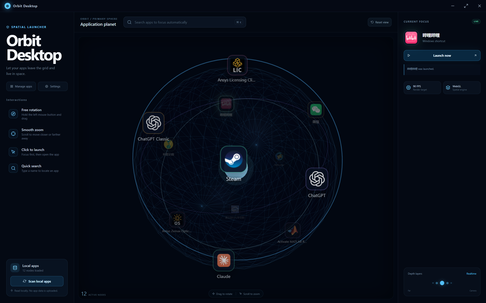
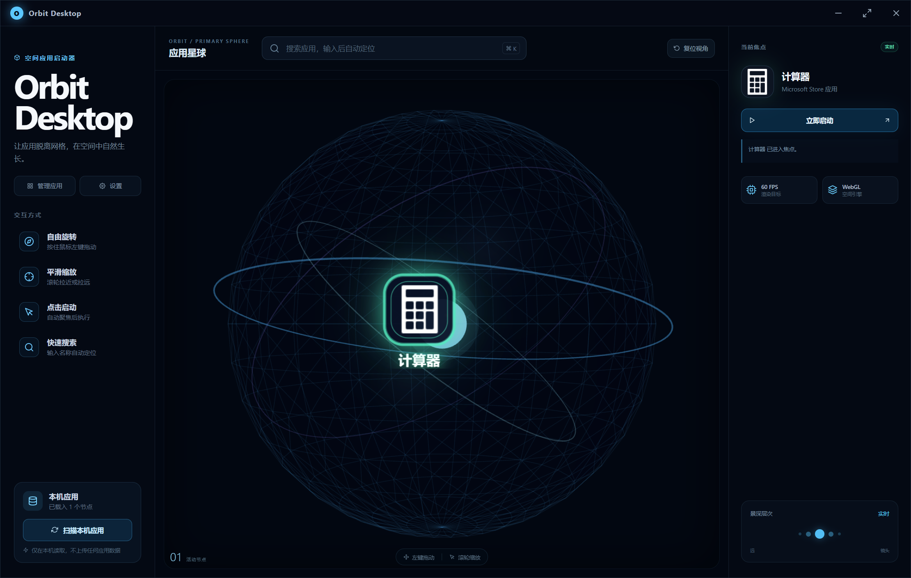

# Orbit Desktop

Orbit Desktop 是一个面向 Windows 的开源 3D 应用启动器。它把真实的本机应用组织成可旋转的空间星球：按快捷键呼出，拖动或搜索应用，聚焦后启动，再回到原来的 Windows 桌面。

> 当前版本：`0.1.0`，可运行的 Windows MVP。项目仍处于早期阶段，不替换 Windows Shell，也不会修改 Explorer、任务栏或系统关键注册表。

## 界面预览





## 当前能力

- 360° 鼠标拖动、松手惯性和平滑滚轮缩放
- 根据镜头距离调整应用节点的大小、亮度与透明度
- 应用节点面向摄像机，支持悬停高亮、点击聚焦与搜索定位
- 从 Windows 的真实应用入口扫描候选应用，扫描后先审查、再添加
- 显示真实应用图标；提取失败时使用明确的 Unknown App 图标
- 本地持久化应用库、图标缓存和用户设置
- 应用管理：查看、启动、移除、重新扫描和手动添加 `.exe` / `.lnk`
- 全局快捷键呼出/隐藏，默认 `Alt + Space`；冲突时提示并允许修改
- 全屏 Launcher、`Esc` 安全隐藏、托盘常驻和可选开机启动
- 简体中文与 English 即时切换，首次运行按系统语言选择默认值
- 外观、交互、性能和动态效果设置
- 窗口隐藏或侧边面板打开时降低 3D 渲染负载

生产入口默认是空应用库，**不会把 Chrome、Steam、Discord、Spotify 等演示节点混入真实扫描结果**。源码中的开发演示数据与正式数据链路隔离，正常运行不会加载它。

## 快速开始

### 环境要求

- Windows 10 或 Windows 11（64 位）
- Node.js `22.12.0` 或更高版本
- npm（随受支持的 Node.js 版本安装）
- 支持 WebGL 的显卡和较新的显卡驱动

建议在 PowerShell 或 Windows Terminal 中执行：

```powershell
git clone <your-repository-url>
cd orbit-desktop
npm ci
npm run dev
```

`npm run dev` 会启动 Vite 开发服务器和 Electron 桌面窗口。结束开发进程后，如托盘中仍有 Orbit Desktop，请从托盘菜单退出。

### 常用命令

```powershell
# 类型检查
npm run typecheck

# 生产构建
npm run build

# 完整自动化测试（unit + Electron）
npm test

# 只运行纯逻辑测试
npm run test:unit

# 只运行 Electron 端到端流程
npm run test:e2e

# 预览前端构建（不包含 Windows 本机能力）
npm run preview
```

Electron 端到端测试使用独立的临时用户目录，不读取现有 Orbit Desktop 应用库，也不会启动或终止真实用户应用。完整覆盖范围见 [tests/QA_INVENTORY.md](tests/QA_INVENTORY.md)。

## 构建 Windows 安装包

```powershell
npm ci
npm run package:win
```

构建产物输出到 `release/`，默认生成可选择安装位置的 NSIS 安装程序。打包配置会把 Windows 应用扫描脚本一起放入应用资源目录。

当前仓库不包含代码签名证书。未签名构建可能触发 Windows SmartScreen；公开发布前应配置可信的 Windows 代码签名，并在干净的 Windows 账户上安装、卸载和升级验证。

如需在“关于”页显示 GitHub 地址，可在构建前设置：

```powershell
$env:VITE_ORBIT_REPOSITORY_URL = "https://github.com/<owner>/<repository>"
npm run package:win
```

配置仓库地址后，“检查更新”会只读查询该仓库的最新 GitHub Release，并比较语义化版本号；它不会自动下载或安装更新，也不能替代安装包签名发布流程。

仓库内置的标签发布工作流会在推送 `v*` 标签时自动使用当前 GitHub 仓库地址构建安装包、上传构建产物并创建 GitHub Release；例如首个公开版本可使用 `v0.1.0`。发布工作流不会自动提供 Windows 代码签名。

## 使用方式

1. 首次启动后点击“扫描本机应用”。
2. 在右侧候选列表中检查名称、图标、来源与启动状态。
3. 勾选需要的应用，再点击“添加选中的应用”。未确认的候选不会进入星球。
4. 拖动星球、使用搜索框，或在“管理应用”中找到目标应用。
5. 点击节点后，星球会平滑聚焦目标；启动请求成功后 Launcher 自动隐藏。

常用操作：

| 操作 | 效果 |
| --- | --- |
| 鼠标左键拖动 | 旋转应用星球 |
| 松开鼠标 | 保持惯性并逐渐减速 |
| 鼠标滚轮 | 平滑拉近或拉远 |
| 点击应用节点 | 聚焦并启动应用 |
| `Ctrl + K` | 聚焦搜索框 |
| `Alt + Space` | 默认全局呼出/隐藏快捷键 |
| `Esc` | 隐藏 Launcher，返回正常桌面 |

关闭窗口按钮默认只隐藏 Orbit Desktop。要彻底退出后台进程，请使用系统托盘菜单中的“退出”。

## Windows 应用扫描

Orbit Desktop 不递归扫描 `Program Files` 下的所有可执行文件。Windows 平台适配器只读取较可信的应用入口：

- 当前用户开始菜单快捷方式
- 系统开始菜单快捷方式
- 当前用户桌面快捷方式
- 公共桌面快捷方式
- `App Paths` 注册应用（当前用户、64 位系统和 WOW6432Node）
- `Get-StartApps` 返回的 Microsoft Store / UWP 应用及其 AUMID

扫描结果会经过路径清理、启动入口验证、名称与启动目标去重，并过滤常见的卸载器、更新器、安装器、Helper、Crash Reporter、后台服务、帮助文档等非用户应用入口。候选结果上限为 300；加入 3D 星球的应用库上限为 32，以控制可读性和渲染成本。

扫描遵循以下规则：

- 扫描只生成候选，不会自动加入应用库。
- 已添加的应用会标记并禁止重复添加。
- 只有通过当前验证的入口可以勾选；无法验证或无效入口不会默认加入。
- `.lnk` 保留快捷方式目标、参数、工作目录和图标位置，并交给 Windows Shell 启动。
- UWP 应用使用 AUMID 和 `shell:AppsFolder` 启动。
- 手动添加只接受用户选择的 `.exe` 或 `.lnk`。
- 从 Orbit Desktop 移除应用只修改本地应用库，**不会卸载应用或删除任何真实文件**。

“入口已验证”表示路径/AUMID 和基本格式在扫描时有效，不等同于对第三方程序安全性、许可状态或运行结果的担保。企业策略、损坏的快捷方式、权限限制和应用自身故障仍可能导致启动失败。

## 真实图标与本地数据

图标按以下顺序尝试获取：UWP 清单 Logo、快捷方式 IconLocation、目标可执行文件、快捷方式本身。成功提取后转换为 PNG 并缓存在 Electron 的用户数据目录；读取失败时显示统一的 Unknown App 图标，不会用随机品牌图标冒充。

以下数据仅保存在当前 Windows 用户的 Electron `userData/orbit-data/` 中：

```text
orbit-data/
├─ applications.json    # 已确认加入的应用及主进程私有启动描述
├─ settings.json        # 语言、快捷键、外观、交互和性能设置
└─ icon-cache/           # 本地提取的 PNG 图标缓存
```

界面渲染进程只接收安全的应用描述和图标，不接收启动路径、命令参数或工作目录。实际启动由 Electron 主进程按应用 ID 执行。

## 设置与国际化

设置页当前包含：

- 通用：语言、开机启动、启动时自动扫描
- 外观：主题、UI 缩放、背景效果
- 交互：旋转灵敏度、惯性强度、缩放速度、全局快捷键
- 性能：FPS 上限、性能模式、粒子和动态效果等级
- 关于：版本、GitHub 地址、许可证与更新入口状态

界面支持 `zh-CN` 和 `en-US`。简体中文系统默认使用中文，其他未支持语言默认使用 English；切换语言立即生效并持久化。翻译目录位于 `src/i18n/locales/`，可继续扩展 `ja-JP`、`zh-TW`、`ko-KR` 等语言。

## 架构

```text
orbit-desktop/
├─ electron/
│  ├─ main.cjs                         # 生命周期、托盘、快捷键、安全 IPC、启动
│  ├─ preload.cjs                      # 最小化的渲染进程桥
│  ├─ platform/windows/
│  │  ├─ applications.cjs              # Windows 扫描、验证、去重与启动描述
│  │  └─ scan-applications.ps1         # Start Menu/Desktop/App Paths/UWP 发现
│  └─ services/                        # 设置、应用库和图标缓存
├─ src/
│  ├─ components/                      # 3D 场景、扫描器、管理和设置 UI
│  ├─ core/                            # 平台无关的应用库规则
│  ├─ i18n/                            # 翻译与语言运行时
│  ├─ platform/adapter.ts              # UI 与桌面能力之间的平台接口
│  ├─ settings/                        # 设置默认值、校验和前端存储
│  └─ App.tsx                          # 页面状态与流程编排
├─ tests/
│  ├─ unit/                            # 应用规则、设置与翻译测试
│  └─ e2e/                             # Electron 真实扫描与关键 UI 流程
└─ .github/workflows/                   # Windows CI 与标签发布
```

React/Three.js 层负责 3D、界面、搜索、设置和国际化；Electron 平台层负责应用扫描、图标、启动、全局快捷键和开机启动。Windows 实现已落地，macOS 适配器尚未实现，但平台边界已独立，避免把 3D 与 UI 逻辑绑定到 Windows API。

Electron 渲染进程启用 `contextIsolation` 和沙箱，关闭 Node.js 集成、WebView、任意窗口打开与非预期导航；主进程只接受来自受信任渲染页面的有限 IPC 请求。

## 隐私与安全

- 不上传应用列表、真实路径、搜索内容、图标或使用行为。
- 不包含遥测、账户、云同步或付费服务。
- 当前运行时不调用 OpenAI API，也不需要 API Key。
- 应用扫描和图标提取全部在本机完成。
- Orbit Desktop 不替换 Windows Shell，不关闭 Explorer，不接管任务栏。
- 崩溃或退出不会阻止用户继续使用正常 Windows 桌面。

被启动的第三方程序可能有自己的网络与隐私行为，这不属于 Orbit Desktop 的数据处理。请只添加和运行你信任的应用入口。

发现安全问题时请不要创建公开 Issue，参见 [SECURITY.md](SECURITY.md)。

## 已知限制

- 当前只实现并验证 Windows 平台；macOS/Linux 仍是未来工作。
- 扫描使用启发式过滤，优先降低误报，因此可能漏掉少数正常应用。
- 某些受保护或非标准 UWP 包可能无法提取 Logo，届时会显示 Unknown App。
- 全局快捷键可能被 PowerToys、输入法或其他 Launcher 占用；请在设置中更换组合键。
- 开机启动只在打包应用中启用，开发模式不会写入登录项。
- 自动下载/安装更新、发布签名和跨版本迁移流程尚未完成；当前仅支持检查最新 GitHub Release。
- 60 FPS 是设计目标，实际性能取决于显卡、分辨率、DPR、节点数量和效果设置。

## 开源发布清单

仓库已经提供 MIT License、贡献指南、行为准则、安全政策、Windows CI 和自动化测试。首次公开发布前建议继续完成：

- [ ] 创建公开 GitHub 仓库，并在需要时补充演示 GIF
- [ ] 在干净的 Windows 10/11 账户上验证安装、启动、扫描、卸载和升级
- [ ] 配置 Windows 代码签名
- [x] 使用 `v*` 标签自动构建并创建 GitHub Release
- [ ] 让 CI 运行完整自动化测试并保留失败产物
- [x] 建立 Issue/PR 模板
- [ ] 补充路线图和首批 `good first issue`
- [ ] 发布 `v0.1.0` Release Notes，明确实验功能与已知限制


## 参与贡献

欢迎提交错误报告、Windows 兼容性反馈、性能数据、翻译和代码改进。开始前请阅读 [CONTRIBUTING.md](CONTRIBUTING.md) 与 [CODE_OF_CONDUCT.md](CODE_OF_CONDUCT.md)。

## 许可证

Orbit Desktop 采用 [MIT License](LICENSE)。

## English summary

Orbit Desktop is an open-source spatial 3D application launcher for Windows, built with Electron, React, TypeScript, Three.js, and React Three Fiber. The current MVP discovers real Windows application entries, lets the user review and select them, caches extracted icons locally, launches approved apps, and provides a configurable global show/hide shortcut. Production starts with an empty library and never mixes demo entries into real scan results. All application metadata stays on the device; no AI API, account, telemetry, or cloud service is required. Windows is implemented today, while the platform-adapter boundary is intended to support a future macOS version.
